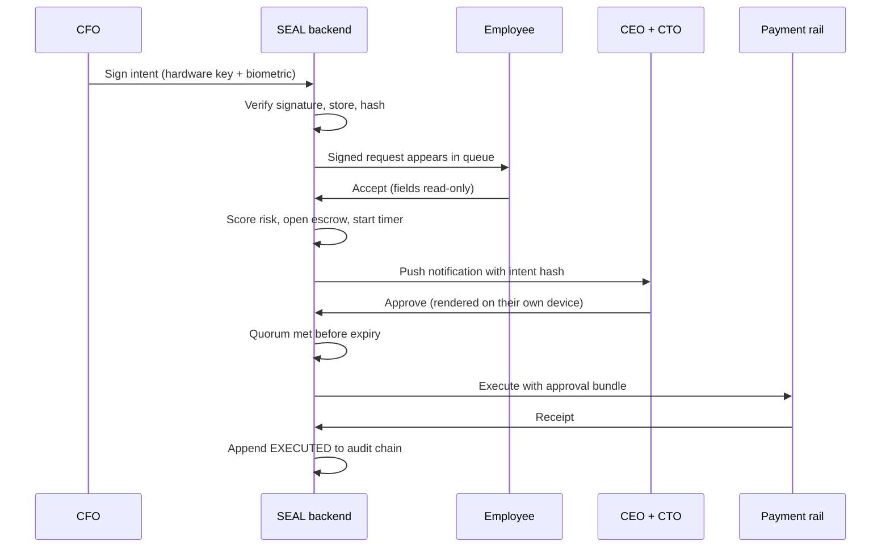
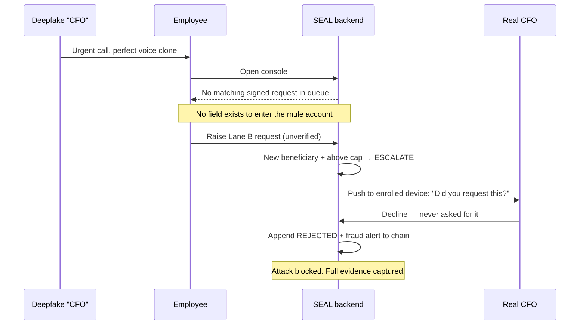

# Deepfake-Resistant Executive Transaction Authorization

**Problem statement:** Microsoft Innovation Club, VIT Chennai — Cybersecurity
**Working name:** SEAL (Signed Executive Authorization Ledger)

---

## 1. The idea in one paragraph

High-risk actions — wire transfers, credential resets, beneficiary changes — can only execute if the executive **cryptographically signed the exact transaction object** with a hardware-bound key, and if that signed object then survives a **time-boxed escrow requiring a quorum of independent approvers**. The phone call, the video meeting, and the email carry zero authority. They become channels for *notification*, not *authorization*. A deepfake can imitate a voice perfectly and still produce nothing the system will accept, because it cannot produce a signature from a key it does not physically hold.

**The one-line version:** *Stop trying to detect the fake. Make the real thing unforgeable and require it.*

---

## 2. What gap this closes

The problem statement names it precisely: existing controls authenticate a **device, account, or channel**. They never establish **intent** — that the real executive approved *this* payee, *this* amount, *this* account.

| What enterprises verify today | What this system verifies |
|---|---|
| The call came from the CFO's number | The CFO's hardware key signed this exact payload |
| The account logging in is the CFO's | The signature covers payee, amount, account, purpose, deadline |
| The audio is probably not synthetic | Two independent approvers confirmed the same hash |
| Fragmented logs across five systems | One tamper-evident chain per transaction |

### The design principle

> **Authority comes from a key, not from a voice.**
> Detection is a risk *signal*. It is never the gate.

This matters because the PS explicitly warns that detection models fail against new generators, noisy telephony, short utterances, and genuine audio replayed out of context. Any architecture whose safety depends on classifier accuracy inherits every one of those failure modes. This one does not.

---

## 3. The three stages

### Stage 1 — The executive signs the transaction

The CFO composes the request in an app on her own device. The app builds a **canonical transaction object** containing every field that matters, hashes it, and signs it with a hardware-bound credential requiring biometric or physical touch (WebAuthn / FIDO2).

The signed object *is* the transaction. It is not a wrapper around a transaction, not an attachment to one.

**Why hardware-bound:** the PS calls out compromised executive accounts. A software key on a malware-infected laptop signs whatever the malware asks. A hardware credential requires a physical touch that malware cannot perform.

**Do not hide the signature inside the message.** Security here comes from key custody, not obscurity. If staff don't know a signature is mandatory, an attacker just sends an unsigned request and nobody notices anything missing. The rule must be loud, mandatory, and machine-enforced.

### Stage 2 — The employee verifies and opens escrow

The employee sees a queue of signed requests. There is no free-form "create payment" screen for signed work. They can **accept or reject** — nothing else. Payment fields are read-only; altering any of them breaks the hash and hard-fails.

This inverts the usual attack. The employee is the person being socially engineered, so the design removes the field where attacker-supplied data would otherwise enter.

Accepting opens an **escrow** with a countdown.

### Stage 3 — Quorum inside the window

Two independent approvers (CEO, CTO, or a configured approver set) must confirm **the same hash**, rendered on their own devices from the signed object — never from a summary the employee typed. What-you-see-is-what-you-sign.

- Both approve inside the window → the payment executes.
- Window closes → the escrow is **voided**, the CFO is alerted, and the record is retained.

**Never actually delete an expired escrow.** A voided escrow is your single best fraud signal. Write it to the audit chain marked `EXPIRED`. Deleting it throws away the alarm.

---

## 4. Two lanes (the realistic path)

Not every request starts with a pre-signed object. Sometimes an employee genuinely needs to ask "can I settle ₹X to this account?" That path must exist — but it must never *look* like a signed one.

| | **Lane A — signed** | **Lane B — employee-originated** |
|---|---|---|
| Origin of the data | CFO's signed payload | Typed by staff, from a call |
| Employee can edit? | No | Yes (structured fields only) |
| Trust level | Verified intent | **Unverified claim** |
| Approver UI | Green "signature valid" | Amber "unverified origin" |
| Amount ceiling | Full authority limit | Capped (e.g. ₹5,00,000) |
| Above the cap | n/a | Escalates — CFO must sign out-of-band |
| Beneficiary check | Advisory | Blocking if not in vendor master |

**The rule that makes Lane B safe:** below the cap and to a known vendor account, two approvals suffice and the workflow stays light. Above the cap, or to any new account, approvals alone cannot execute it. The request converts into a signature request pushed to the CFO's enrolled device showing the exact fields.

That is what closes the deepfake loop. The attacker owns the phone call. The attacker does not own the CFO's device. The real CFO opens the prompt, sees a large payment to an account she's never heard of, and declines.

**Escalate, never dead-end.** Lane B over the cap becomes a signature request, not a refusal. The employee is routed, not blocked — which keeps the false-challenge rate down.

---

## 5. Risk-tiered timing

A fixed 90-minute hold on everything gets routed around, and the PS scores you on verification time and false-challenge rate, not only on block rate.

| Risk tier | Trigger | Approvers | Window |
|---|---|---|---|
| Low | Known payee, under threshold, business hours | 1 | 15 min |
| Medium | Known payee, above threshold | 2 | 60 min |
| High | New beneficiary, or large amount | 2 + CFO signature | 90 min |
| Critical | New beneficiary **and** large **and** off-hours | 2 + CFO + treasury head | 90 min, no fast-track |

**Urgency raises the score, it never shortens the clock.** Manufactured pressure is the attacker's primary tool — secrecy, authority, urgency, channel switching are all listed in the PS as deliberate tactics. Treat each as a risk input.

**Provide a real break-glass path** with *higher* assurance (three approvers, video callback to a pre-registered number, mandatory post-hoc review). If there is no legitimate 2 a.m. route, people will invent an illegitimate one.

---

## 6. The audit trail

The PS complains that telephony metadata, session risk, device identity, payment details, behaviour, and approval records live in separate systems and only get correlated after an incident. Fixing that is a scoreable win on its own.

Every state change appends one entry to a **hash-chained, append-only log**:

```
entry_n.prev_hash = SHA256(entry_n-1)
```

Any retroactive edit breaks the chain from that point forward and is detectable by replaying it.

**What each transaction's chain holds:**

- The canonical intent object and its hash
- The signature, credential ID, signature counter, and authenticator metadata
- Which lane the data came from (signed vs. staff-entered) — this is the field nobody logs today
- Risk score and every rule that fired
- Each approval: who, when, from which device, over which hash
- Channel context: caller ID, session ID, meeting join metadata, if present
- Final outcome: `EXECUTED`, `EXPIRED`, `REJECTED`, `ESCALATED`
- The execution receipt from the payment rail

Six months later, "employee-entered, CFO-confirmed at 14:11" and "CFO-signed at 14:01" are very different answers to an auditor. Most systems today cannot tell you which one happened.

---

## 7. Enforcement point

> If the employee can still log into the bank portal and pay manually, the escrow is advisory, not a control.

The payment API (and the IAM system, for credential resets) must **reject any request lacking a valid approval bundle**. The bundle contains the signed intent, the escrow ID, and both approver signatures. The rail verifies the chain independently.

For a demo, build a mock bank service that returns `403 APPROVAL_BUNDLE_INVALID` for anything else. This single component is what turns a workflow into a security control, and it demos beautifully.

---

## 8. Tech stack

### Recommended stack

| Layer | Choice | Why this one |
|---|---|---|
| Frontend | React 18 + TypeScript + Vite | WebAuthn is a browser API; shared types with a TS backend |
| UI kit | Tailwind CSS + shadcn/ui | Fast to build the three role dashboards |
| Approver client | PWA (installable) | Platform authenticator = Face ID / fingerprint, no app-store friction |
| Backend | Node.js + NestJS (or Fastify) | One language end-to-end; strong WebAuthn library support |
| Signing | WebAuthn / FIDO2 via `@simplewebauthn/server` + `@simplewebauthn/browser` | Hardware-bound keys, user-presence enforced, no private key ever server-side |
| Canonicalization | JCS — RFC 8785 (`canonicalize` npm) | Deterministic JSON serialization so the hash is reproducible |
| Hashing | SHA-256 | Standard, fast, well-understood |
| Database | PostgreSQL 16 | Transactional integrity; `pg_trgm` for fuzzy payee matching |
| ORM | Prisma or Drizzle | Type-safe schema, quick migrations |
| Escrow timers | BullMQ + Redis (delayed jobs) | Durable countdown that survives restarts |
| Realtime | Socket.IO or SSE | Live countdown and approval status on every screen |
| Push notifications | Firebase Cloud Messaging | Out-of-band prompt to the CFO's registered device |
| Fallback channel | Twilio SMS | For the escalation ping when push fails |
| Risk engine | Rules in TypeScript, optional XGBoost service | Rules are explainable and auditable; ML only as an extra signal |
| Payment rail | Mock bank service (Express) | Demonstrates the enforcement point |
| Deployment | Docker Compose → Render / Railway / Fly.io | One-command demo environment |

### Substitutions if the team prefers Python

- Backend: **FastAPI** + Pydantic
- WebAuthn: **`py_webauthn`** (Duo Labs)
- Canonicalization: **`rfc8785`**
- Jobs: **Celery + Redis**, or **APScheduler** for a simpler MVP
- Everything else is unchanged.

### If WebAuthn proves too heavy for the timeline

Fall back to **Ed25519 via libsodium**, with the private key stored in the OS keychain / Android Keystore / iOS Secure Enclave. You lose the phishing-resistant origin binding that WebAuthn gives you free, so say so explicitly in the presentation rather than pretending otherwise. Judges respect a stated limitation far more than a hidden one.

### Optional: deepfake detection as a signal

You may integrate an audio-liveness or synthetic-speech classifier — but wire it as a **risk score input only**, never a gate. Frame it in the pitch this way: *"detection raises the tier; it never grants authority."* This directly answers the PS point that detection alone is insufficient, and it turns a weakness into a design argument.

### What NOT to build

Do not make a deepfake classifier the centrepiece. Every other team will. It is also the approach the problem statement itself argues against, so building it signals you didn't read past the title.

---

## 9. Data model

### Canonical transaction intent

```json
{
  "v": 1,
  "txn_id": "TX-4471",
  "org_id": "acme-corp",
  "type": "wire_transfer",
  "payee": {
    "name": "Alton Logistics Pvt Ltd",
    "account": "50100XXXX4419",
    "ifsc": "HDFC0001234"
  },
  "amount": { "value": "4200000.00", "currency": "INR" },
  "purpose": "Vendor settlement Q3",
  "deadline": "2026-09-05T18:00:00+05:30",
  "originator": { "user_id": "u_priya", "role": "CFO" },
  "nonce": "b7f3a91c4e2d8f60",
  "iat": "2026-09-03T14:01:12+05:30",
  "exp": "2026-09-03T15:31:12+05:30"
}
```

Canonicalize with JCS → SHA-256 → sign with WebAuthn. Store the public key, credential ID, and signature counter server-side. **Never the private key** — it never leaves the authenticator.

**Replay protection** comes from four fields working together: `nonce` (unique per intent), `txn_id`, `iat`/`exp` (bounded validity), plus a single-use consumption table. Without these, a captured legitimate approval from last month can be resubmitted.

### Escrow object

```json
{
  "escrow_id": "ESC-9f2a",
  "intent_hash": "9f2ab40e7d13c71f...",
  "lane": "A",
  "state": "PENDING_QUORUM",
  "opened_by": "u_aravind",
  "opened_at": "2026-09-03T14:02:40+05:30",
  "expires_at": "2026-09-03T15:32:40+05:30",
  "risk": { "tier": "HIGH", "score": 72, "rules_fired": ["NEW_BENEFICIARY", "ABOVE_THRESHOLD"] },
  "required_approvals": 2,
  "approvals": [
    { "user_id": "u_anita", "role": "CTO", "at": "14:19:03", "sig": "MEUCIQ..." }
  ]
}
```

### State machine

```
DRAFT ──sign──▶ SIGNED ──employee accepts──▶ PENDING_QUORUM
                                                  │
                    ┌─────────────────────────────┼──────────────────────┐
                    ▼                             ▼                      ▼
                 APPROVED                     REJECTED                EXPIRED
                    │                        (approver said no)   (timer ran out,
                    ▼                                              CFO alerted)
                EXECUTED

Lane B only:  PENDING_QUORUM ──over cap──▶ ESCALATED ──CFO signs──▶ PENDING_QUORUM
```

Every transition appends to the audit chain. There is no transition that deletes anything.

### Core tables

| Table | Purpose |
|---|---|
| `users` | Identity, role, approval authority limits |
| `credentials` | WebAuthn public keys, credential IDs, signature counters |
| `intents` | Canonical objects + signatures + hashes |
| `escrows` | State, timers, risk scores |
| `approvals` | One row per approver signature over an intent hash |
| `vendor_master` | Known payees and their verified accounts |
| `audit_chain` | Append-only, hash-linked; `UPDATE`/`DELETE` revoked at the DB role level |
| `consumed_nonces` | Single-use enforcement |

---

## 10. API surface

```
POST   /api/credentials/enroll/begin      Start WebAuthn registration
POST   /api/credentials/enroll/finish     Complete — QUORUM-GATED (see below)

POST   /api/intents                       CFO submits a signed intent
GET    /api/intents/:id                   Fetch + server-side signature verify
POST   /api/intents/:id/accept            Employee accepts → opens escrow
POST   /api/intents/:id/reject            Employee rejects

POST   /api/escrows                       Lane B: employee-originated request
GET    /api/escrows/:id                   Full state incl. live countdown
POST   /api/escrows/:id/approvals         Approver signs over the intent hash
POST   /api/escrows/:id/reject            Approver declines
POST   /api/escrows/:id/escalate          Lane B over cap → request CFO signature

POST   /api/payments/execute              ENFORCEMENT POINT — requires valid bundle
GET    /api/audit/:txn_id                 Full chain, independently verifiable
GET    /api/audit/:txn_id/verify          Recompute the chain, return integrity result
```

**Key enrollment must be quorum-gated.** The entire model rests on knowing the CFO's public key, so the attack simply moves to *"register a new key for the CFO."* Enrollment and rotation need the same approval quorum as a high-value payment. This is the most commonly missed hole in designs like this one, and calling it out earns credibility.

---

## 11. Workflows

### Lane A — happy path



### The attack path — where it dies



The attacker controls the call. The attacker does not control the CFO's device. That asymmetry is the whole design.

---

## 12. Screens to build

| # | Screen | Role | Must show |
|---|---|---|---|
| 1 | Compose + sign | CFO | Field entry, biometric prompt, signature confirmation |
| 2 | Request queue | Employee | Only signed requests; no create button |
| 3 | Verification detail | Employee | Green "signature valid" banner, **locked** fields, signer identity, key age |
| 4 | Lane B request | Employee | Structured fields, permanent "unverified origin" warning |
| 5 | Approver panel | CEO / CTO | Countdown, intent hash, approver rail, approve / decline |
| 6 | Escalation prompt | CFO | Out-of-band: "Did you request this?" with exact fields |
| 7 | Audit viewer | Auditor | Full chain, integrity check, origin lane per field |
| 8 | Risk console | SecOps | Live escrows, expired/voided alerts, blocked attempts |

**The single most important UI rule:** a Lane B request must never render like a Lane A one. Different colour, different banner, different wording. If the two screens look the same, the quorum is theatre — approvers will rubber-stamp attacker-supplied data because it arrived inside a clean-looking process.

---

## 13. Attack analysis

| Attack | Why it fails |
|---|---|
| Voice-cloned CFO demands a transfer | No signed intent exists. No field to enter the mule account. |
| Deepfake video in a live meeting | Same — the meeting has no authorization power at all. |
| Compromised CFO email account | Email cannot produce a hardware signature. |
| Compromised CFO laptop (malware) | Hardware credential requires physical touch; malware cannot press it. |
| Employee coerced into cooperating | Cannot edit signed fields; Lane B is capped and escalates to the CFO. |
| Replay of a genuine past approval | Nonce + expiry + single-use consumption table reject it. |
| Attacker enrols a new key for the CFO | Enrollment is quorum-gated, same as a large payment. |
| Approver rushed into rubber-stamping | Their screen renders from the signed object; the hash they sign is the hash that executes. |
| Attacker waits out the timer, retries | Expired escrows are logged and alert the CFO — retries raise the risk score. |
| Insider tampers with logs to hide it | Hash chain breaks; `/audit/verify` detects the break and its position. |

### Honest limitations — state these openly

- A **coerced executive under duress** will sign a valid transaction. Mitigation: a duress credential that signs but silently flags. Not a full solution.
- **Collusion of two approvers** defeats the quorum. Mitigation: raise `n` for the highest tier; add post-hoc review.
- **Adoption is the real barrier.** The system only works where it is enforced at the rail. Partial rollout leaves the old path open.
- **Lost or broken authenticator** needs a recovery path, and every recovery path is an attack surface. Quorum-gate it.

Naming these yourself is stronger than being asked about them.

---

## 14. Metrics

Map directly onto the PS scoring criteria:

| Metric | Definition | Target |
|---|---|---|
| Attack-block rate | Simulated impersonation attempts stopped | 100% for signature-required tiers |
| Legitimate approval success | Genuine requests completing without escalation | > 95% |
| False-challenge rate | Genuine requests wrongly escalated | < 5% |
| Median verification time | Signature → execution, low-risk tier | < 3 min |
| Prevented fraudulent value | ₹ value of blocked attempts | Report cumulative |
| Audit completeness | Transactions with an unbroken chain | 100% |

Instrument these from day one and show a live dashboard in the demo. Numbers on screen beat claims in slides.

---

## 15. Build plan (36-hour hackathon shape)

| Phase | Hours | Deliverable |
|---|---|---|
| 1 | 0–8 | WebAuthn enroll + sign + server-side verify; canonical JSON + hash; Postgres schema |
| 2 | 8–16 | Escrow lifecycle, BullMQ timers, quorum logic, realtime countdown |
| 3 | 16–24 | Risk engine rules, Lane B, vendor master check, CFO out-of-band escalation |
| 4 | 24–30 | Hash-chained audit log + viewer; mock bank enforcing the approval bundle |
| 5 | 30–36 | Attack simulation script, metrics dashboard, demo rehearsal |

**If time runs short, cut in this order:** metrics dashboard → risk ML → Lane B → realtime updates. Never cut the signature verification, the enforcement point, or the audit chain. Those three *are* the project.

---

## 16. Demo script

Five acts, roughly six minutes.

1. **The setup.** Show the CFO signing a legitimate ₹42L vendor payment with a fingerprint. Ten seconds.
2. **The happy path.** Employee accepts, escrow opens, CTO and CEO approve on phones, payment executes. Show the countdown live.
3. **The attack.** Play a cloned-voice call demanding an urgent transfer to a different account. Let it be convincing.
4. **The kill.** Employee opens the console — nothing in the queue. They raise a Lane B request; it escalates; the real CFO's phone lights up with *"Did you request this?"*; she declines. The transfer dies with nothing to override.
5. **The receipt.** Open the audit viewer. The blocked attempt is already recorded with its full chain, the origin lane, and the risk rules that fired.

Close on the sentence that frames the whole project: **the deepfake was perfect, and it didn't matter.**

---

## 17. Future work

- Duress credentials that sign-and-flag
- Vendor-side signing so beneficiary changes are also cryptographically originated
- Cross-organisation trust: verify a supplier's CFO signature against a published key directory
- Daily Merkle root anchoring to an external transparency log
- Behavioural baselines per approver (approval latency, device, time of day) as additional risk inputs
- Standards alignment: map the approval bundle to ISO 20022 payment message extensions

---

## Appendix — the sentence to lead the pitch with

> Every other team will build a deepfake detector. The problem statement itself explains why detection fails — new generators, noisy audio, short clips, real voices out of context. We built the control that works **even when detection fails completely**: nothing high-risk executes without a hardware signature over the exact transaction and an independent quorum inside a bounded window. The fake can be flawless. It still authorizes nothing.
